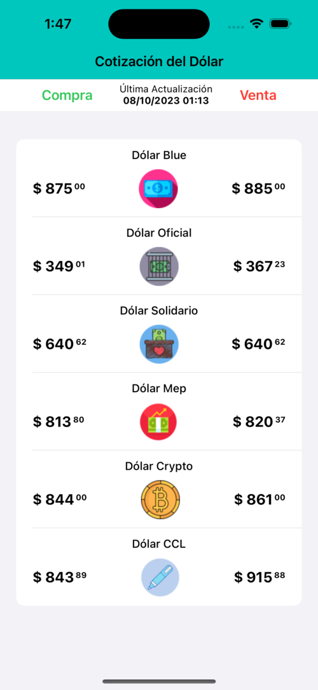

# Dolarizate - Tu Compañero de Cotizaciones de Dólar


## Descripción

Dolarizate es tu aplicación confiable para mantenerse al tanto de las cotizaciones del dólar en el mercado argentino. Con un diseño simple y elegante, te brindamos la información que necesitas de manera rápida y eficiente.

## Características Principales

- Muestra las distintas cotizaciones del dólar en tiempo real.
- Utiliza componentes de SwiftUI para una experiencia de usuario fluida.
- Consulta un archivo JSON alojado en la nube, actualizado automáticamente.
- Mínimo consumo de energía, sin búsquedas en tiempo real ni bases de datos.
- Actualizaciones automáticas para mantenerte siempre informado.

## Requisitos

Dolarizate es compatible con dispositivos iOS que ejecutan iOS X.X o posterior.

## Cómo Funciona

Dolarizate consulta un archivo JSON alojado en la nube, el cual es generado y actualizado automáticamente por un proceso externo a la aplicación. Esto garantiza que siempre tengas acceso a información precisa y actualizada sobre las cotizaciones del dólar en el mercado argentino.

## Capturas de Pantalla




## Contacto

Si tienes preguntas, sugerencias o necesitas asistencia, no dudes en contactarnos en [tu dirección de contacto].

¡Gracias por elegir Dolarizate para mantenerte informado sobre las cotizaciones del dólar en Argentina!

[Descargar desde la App Store](enlace-a-la-app-en-la-app-store)
```

Recuerda personalizar este README con enlaces a tus propias imágenes, enlaces de descarga desde la App Store y tu dirección de contacto. También, asegúrate de actualizar la versión de iOS compatible según lo necesario. Este README proporciona una descripción general de tu aplicación y sus características principales para los usuarios potenciales.
